# progressive_growing_GAN
pGAN with/without minibatch standard deviation
## Architecture of a single block
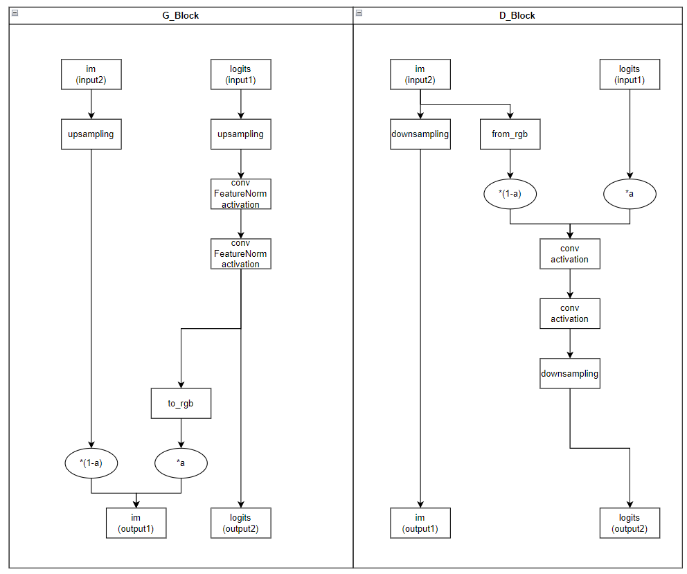
## Some results image 
### Without mnbstd layer
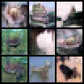
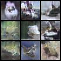
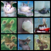
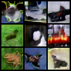

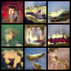

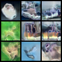
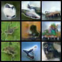
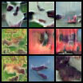
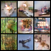

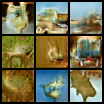
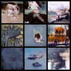
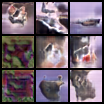
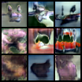
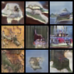
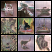
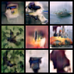
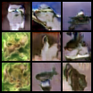
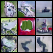
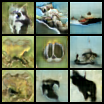
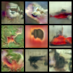
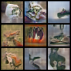

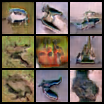
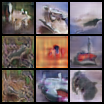
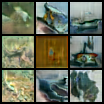
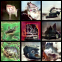
### With mnbstd layer
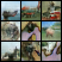

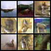
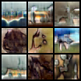
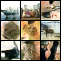
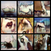
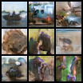
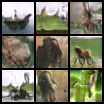
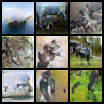
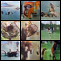
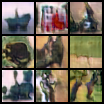
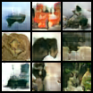
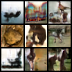
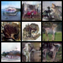
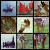
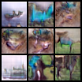
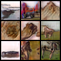
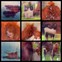
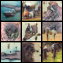

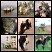
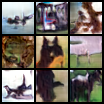
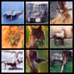
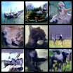
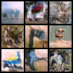
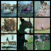

